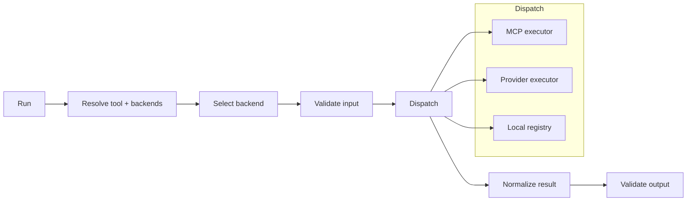
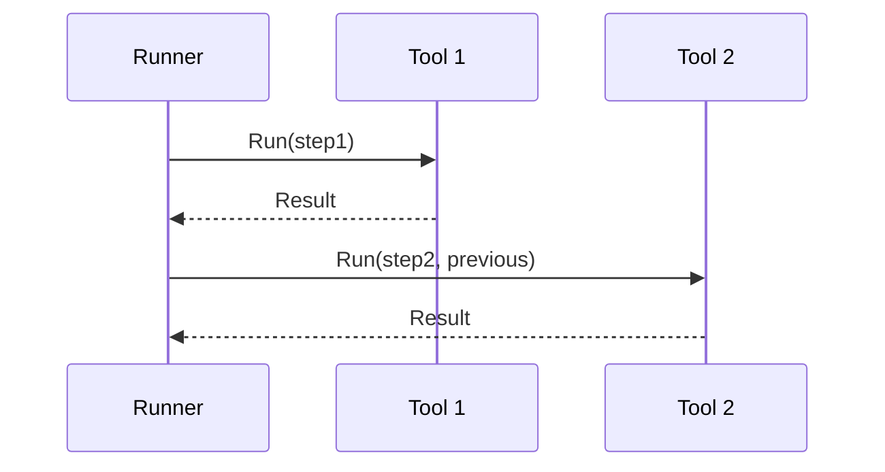

# Architecture

`toolrun` implements a consistent execution pipeline with validation and
backend dispatch. It is transport-agnostic and depends on `toolmodel` types.

```mermaid
flowchart LR
  A[Run] --> B[Resolve tool + backends]
  B --> C[Select backend]
  C --> D[Validate input]
  D --> E[Dispatch]
  E --> F[Normalize result]
  F --> G[Validate output]

  subgraph Dispatch
    M[MCP executor]
    P[Provider executor]
    L[Local registry]
  end
  E --> M
  E --> P
  E --> L
```

## Chain execution

```mermaid
sequenceDiagram
  participant R as Runner
  participant T1 as Tool 1
  participant T2 as Tool 2

  R->>T1: Run(step1)
  T1-->>R: Result
  R->>T2: Run(step2, previous)
  T2-->>R: Result
```
