# User Journey

This journey shows how `toolrun` executes tools and chains in a full end-to-end agent flow.

## End-to-end flow (stack view)

```mermaid
%%{init: {'theme': 'base', 'themeVariables': {'primaryColor': '#38a169', 'primaryTextColor': '#fff'}}}%%
flowchart LR
    subgraph input["Input"]
        Request["📥 Run(toolID, args)"]
    end

    subgraph resolve["Resolution"]
        GetTool["🔍 GetTool(id)"]
        GetBackends["⚙️ GetAllBackends(id)"]
        Select["🎯 BackendSelector<br/><small>local > provider > mcp</small>"]
    end

    subgraph validate1["Input Validation"]
        ValIn["✅ ValidateInput()<br/><small>JSON Schema</small>"]
    end

    subgraph dispatch["Dispatch"]
        Backend{"Backend<br/>Type?"}
        Local["🏠 Local"]
        Provider["🔌 Provider"]
        MCP["📡 MCP"]
    end

    subgraph normalize["Normalize"]
        Norm["📤 NormalizeResult()"]
    end

    subgraph validate2["Output Validation"]
        ValOut["✅ ValidateOutput()<br/><small>optional</small>"]
    end

    subgraph output["Output"]
        Result["📦 RunResult<br/><small>Structured | Text | Error</small>"]
    end

    Request --> GetTool --> GetBackends --> Select --> ValIn --> Backend
    Backend -->|local| Local --> Norm
    Backend -->|provider| Provider --> Norm
    Backend -->|mcp| MCP --> Norm
    Norm --> ValOut --> Result

    style input fill:#3182ce,stroke:#2c5282
    style resolve fill:#d69e2e,stroke:#b7791f
    style validate1 fill:#38a169,stroke:#276749
    style dispatch fill:#6b46c1,stroke:#553c9a,stroke-width:2px
    style normalize fill:#e53e3e,stroke:#c53030
    style validate2 fill:#38a169,stroke:#276749
    style output fill:#3182ce,stroke:#2c5282
```




### Chain Execution

```mermaid
%%{init: {'theme': 'base', 'themeVariables': {'primaryColor': '#6b46c1'}}}%%
sequenceDiagram
    autonumber
    participant Client as 🖥️ Client
    participant Runner as ▶️ Runner
    participant Step1 as 📌 Step 1
    participant Step2 as 📌 Step 2

    Client->>+Runner: RunChain([step1, step2])

    rect rgb(56, 161, 105, 0.1)
        Runner->>+Step1: Run("github:get_repo", args)
        Step1-->>-Runner: {repo: {...}}
        Note right of Runner: Store as "previous"
    end

    rect rgb(214, 158, 46, 0.1)
        Runner->>Runner: args["previous"] = step1Result
        Runner->>+Step2: Run("github:list_issues", {previous: ...})
        Step2-->>-Runner: {issues: [...]}
    end

    Runner-->>-Client: ChainResult {final, steps[]}
```



## Step-by-step

1. **Resolve** the tool and its backends (via `toolindex` or resolver callbacks).
2. **Select** the backend (default priority: local > provider > MCP).
3. **Validate input** against JSON Schema.
4. **Dispatch** to the selected backend.
5. **Normalize output** (structured content preferred).
6. **Validate output** (optional).

## Example: run a tool

```go
runner := toolrun.NewRunner(
  toolrun.WithIndex(idx),
  toolrun.WithMCPExecutor(mcpExec),
)

res, err := runner.Run(ctx, "github:get_repo", map[string]any{
  "owner": "acme",
  "repo":  "app",
})
```

## Example: chain two tools

```go
steps := []toolrun.ChainStep{
  {ToolID: "github:get_repo", Args: map[string]any{"owner": "acme", "repo": "app"}},
  {ToolID: "github:list_issues", UsePrevious: true},
}

final, stepsOut, err := runner.RunChain(ctx, steps)
```

## Expected outcomes

- Consistent execution across backends.
- Structured results suitable for chaining.
- Explicit error classification with `ToolError`.

## Common failure modes

- `ErrToolNotFound` if the tool is missing.
- `ErrValidation` for schema violations.
- `ErrExecution` for backend errors.
- `ErrStreamNotSupported` when streaming is requested but unsupported.
